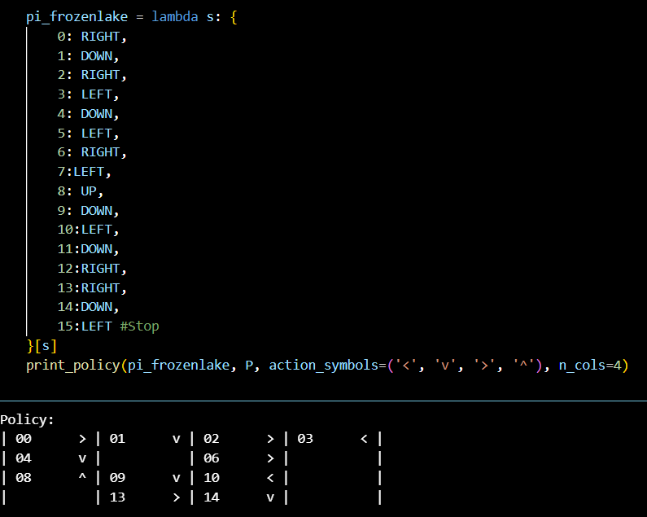

# POLICY EVALUATION

## AIM
To simulate the Frozen-lake MDP and compare different policy functions.

## PROBLEM STATEMENT
The problem involves simulating a Frozen-lake MDP and defining various policy functions for it, these policy functions are later evaluated by a policy_evaluation() function which compares the value function of the policies passed as parameter. This is an experiment in reinforcement learning where you test different policies in FrozenLake, both by simulation (probability of reaching the goal) and by formal policy evaluation (computing expected long-term rewards).

## POLICY EVALUATION FUNCTION


```
def policy_evaluation(pi, P, gamma=1.0, theta=1e-10):
    V = np.zeros(len(P), dtype=np.float64)
    while True:
        delta = 0
        for s in range(len(P)):
            v = 0
            a = pi(s)
            for prob, next_state, reward, done in P[s][a]:
                v += prob * (reward + gamma * V[next_state] * (not done))
            delta = max(delta, abs(v - V[s]))
            V[s] = v
        if delta < theta:
            break
    return V
```

## OUTPUT:

### policies:



### State value function:


### Compare:


### Best Policy:


## RESULT:
Thus we have successfully evaluated two different policies for a given env and compared their values functions.